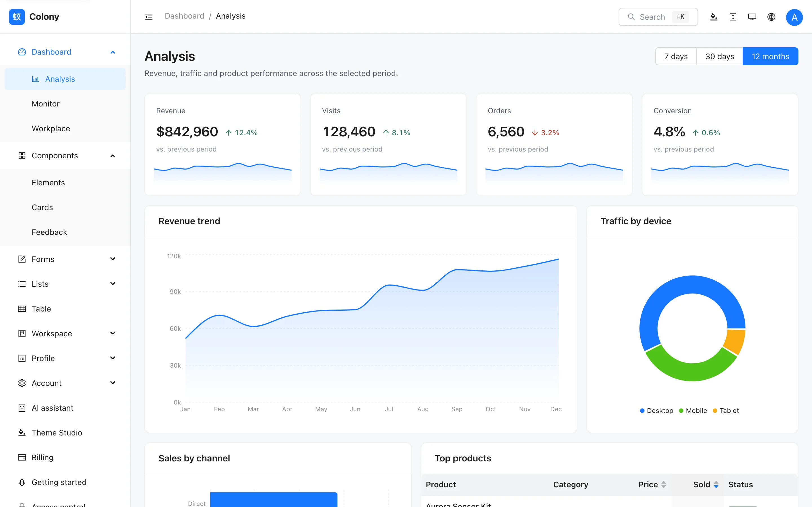
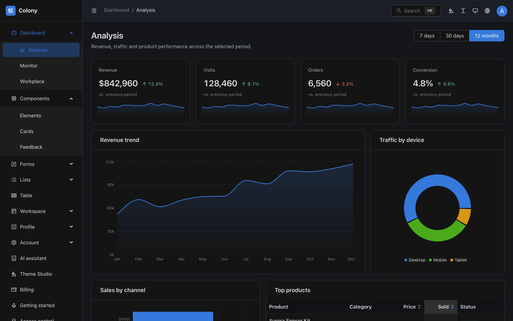
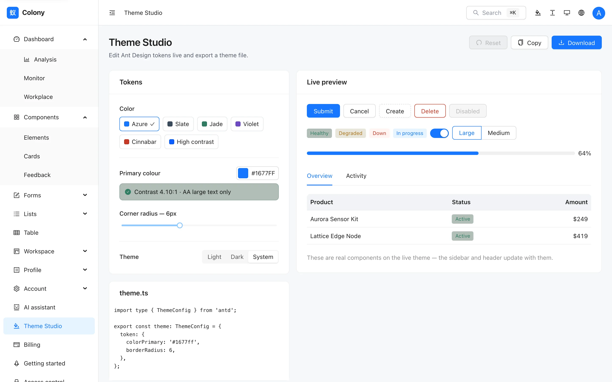
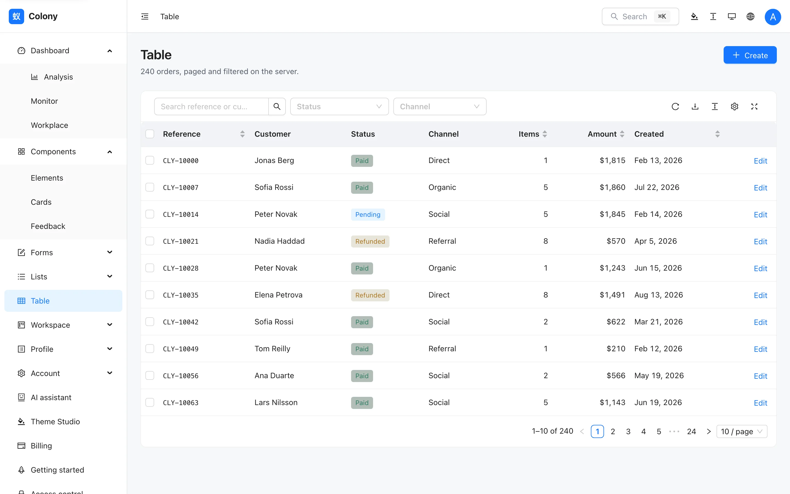
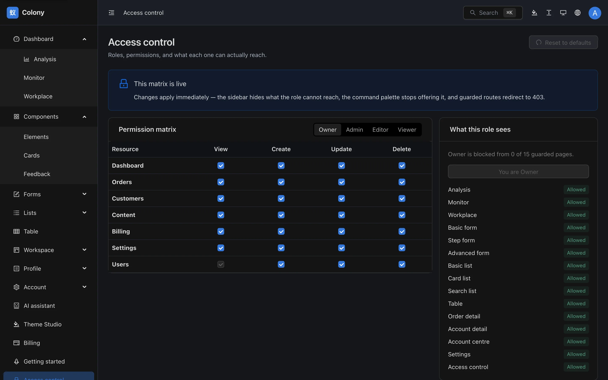
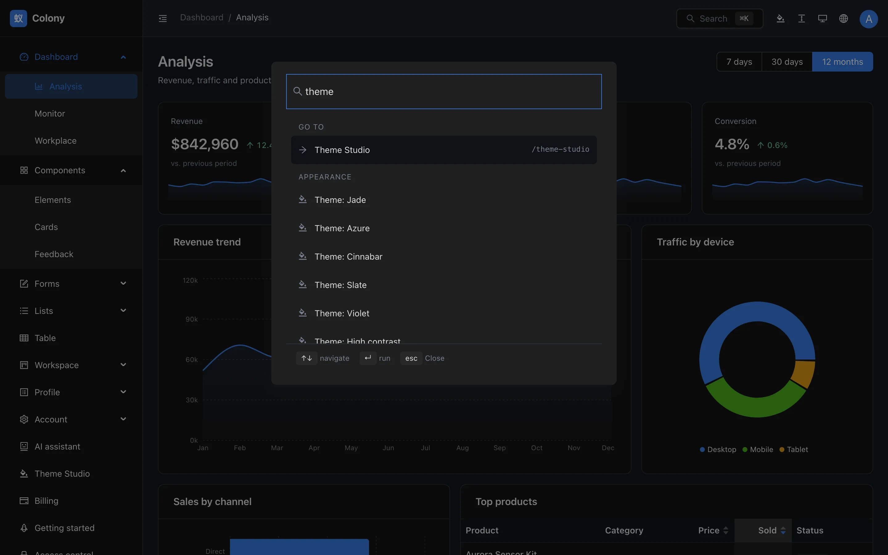
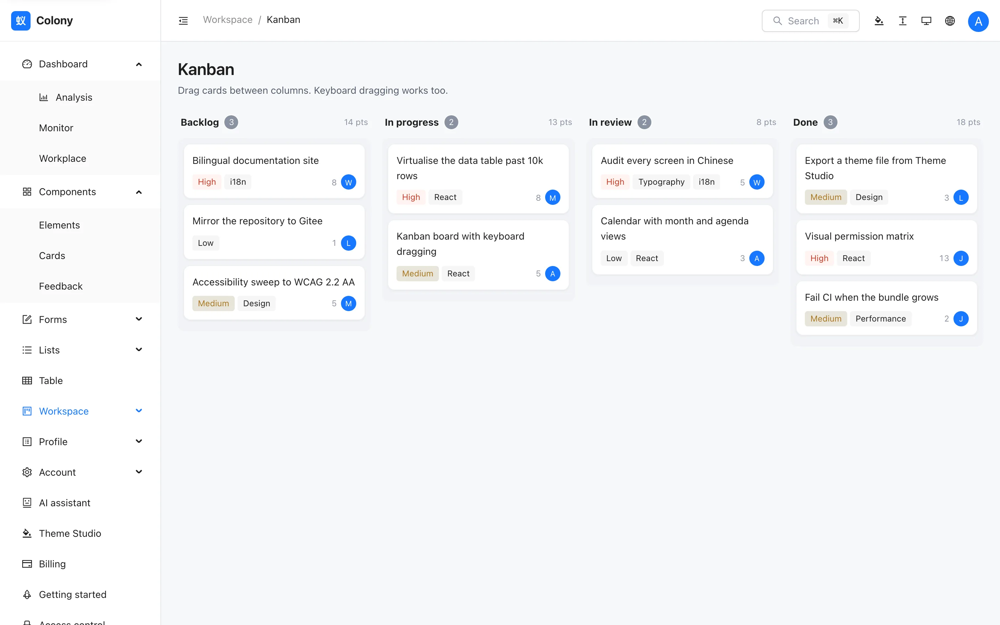
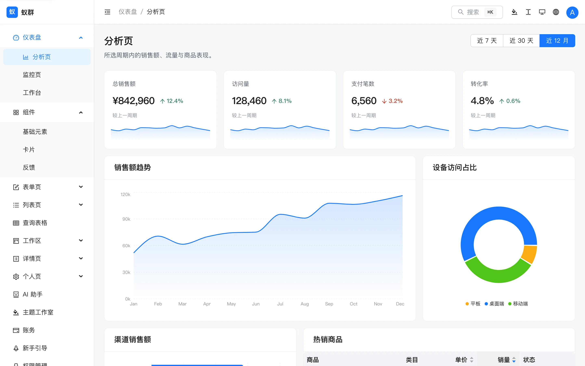
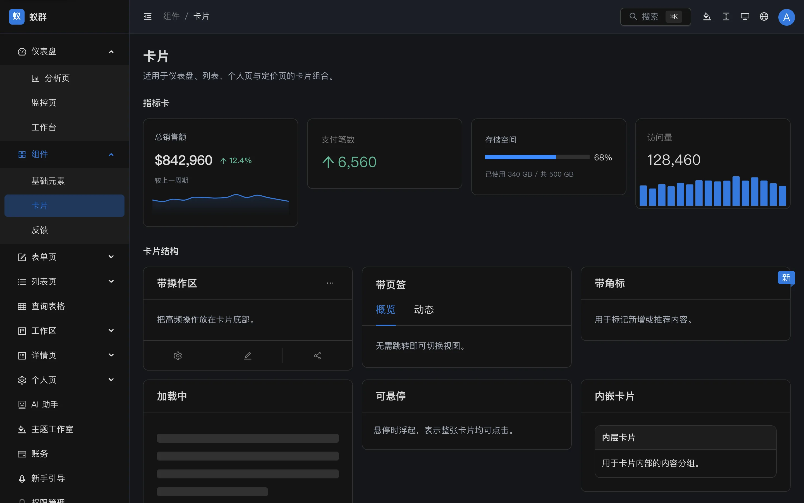

<div align="center">

# 蚁群 · Colony

**基于 Ant Design v6 的免费 React 中后台模板 —— 不绑定任何上层框架。**

[English](./README.md) · [简体中文](./README.zh-CN.md)

</div>

---

> **状态：Beta。** 第 1、2 阶段均已完成 —— Ant Design Pro 的 24 个路由全部具备，
> 另有主题工作室、命令面板、可视化权限矩阵，以及 8 个 Pro 所没有的页面。
> 下一步是双语文档站。详见[路线图](#路线图)。

## 界面预览

<p align="center">
  
</p>

<table>
  <tr>
    <td width="50%"><br><em>深色模式 —— 共三种状态而非两种：显式浅色、显式深色，以及不写入任何标记的跟随系统。</em></td>
    <td width="50%"><br><em>主题工作室 —— 实时编辑 antd Token，取色器旁直接显示 WCAG 对比度。</em></td>
  </tr>
  <tr>
    <td><br><em>DataTable —— 服务端分页、排序与分面筛选，并内置安全的 CSV 导出。</em></td>
    <td><br><em>可视化权限 —— 勾选即时生效，侧边栏、命令面板与路由守卫同步响应。</em></td>
  </tr>
  <tr>
    <td><br><em>⌘K 命令面板 —— 以子序列匹配覆盖全部路由与设置。</em></td>
    <td><br><em>看板 —— 支持指针拖拽与键盘拖拽。</em></td>
  </tr>
  <tr>
    <td><br><em>中文不是一层翻译 —— 汉字拥有独立的字号体系。</em></td>
    <td><br><em>每个页面都在四种状态下走查：浅色/深色 × 中文/英文。</em></td>
  </tr>
</table>

## 为什么要做这个

Ant Design Pro 是官方中后台方案，本身质量很好。但使用它就意味着要接受
[`@umijs/max`](https://umijs.org) —— 它的构建脚本就是 `max dev` 和 `max build`。
如果团队已经在用 Vite，为了一个中后台再学一整套上层框架，成本并不低。

还有第二个问题。ProComponents（`ProTable`、`ProForm`、`ProLayout`）是 Pro 的核心，
而它在 npm 上的现状是：

| dist-tag | 版本 | 发布时间 | 声明支持的 antd |
|---|---|---|---|
| `latest` | 2.8.10 | 2025-07-17 | 仅 antd 4 / 5 |
| `beta` | 3.1.14-6 | 2026-07-29 | antd ^6.0.0 |

执行 `npm i @ant-design/pro-components` 安装到的版本并未声明支持 antd v6，
且已有 13 个月没有正式发布。Ant Design Pro 本身通过锁定预发布版本来绕开这一点。

**蚁群不依赖 ProComponents。** 依赖树中没有任何预发布版本。

## 技术栈

| | |
|---|---|
| 构建 | Vite 8（Rolldown） |
| 组件库 | Ant Design 6 |
| 语言 | TypeScript 6，`strict` |
| 路由 | React Router 8 |
| 服务端状态 | TanStack Query 5 |
| 表格 | antd Table + 自建工具栏 |
| 表单 | React Hook Form + Zod 4 |
| 客户端状态 | Zustand 5 |
| 图表 | Recharts 3 |
| 数据模拟 | MSW 2 |
| 国际化 | i18next —— `zh-CN` 与 `en-US` 同为一等公民 |
| 测试 | Vitest 4（59 项）· Playwright（123 项）|

## 快速开始

```bash
pnpm create colony-admin my-app
cd my-app && pnpm install && pnpm dev
```

或直接克隆：

```bash
pnpm install
pnpm dev          # http://localhost:5273
```

完整文档（中英双语）：**[colony.colorlib.com](https://colony.colorlib.com)**

```bash
pnpm build        # 类型检查 + 生产构建
pnpm test         # 单元测试
pnpm lint         # 代码检查
```

## 体积

以无头 Chromium 访问各项目的公开演示站，统计首屏 gzip 传输的 JS：

| | 首屏 JS |
|---|---|
| **蚁群** —— 最重的页面（`/dashboard/analysis`） | **509 kB** |
| 蚁群 —— `/auth/login` | 330 kB |
| Ant Design Pro | 1,178 kB |
| design-sparx（273 star 的同类项目） | 763 kB |
| soybean-admin（Vue + Naive UI） | 603 kB |
| vue-vben-admin（Vue） | 312 kB |

CI 会执行 gzip 体积预算检查（`pnpm size`），超出即构建失败。
`pnpm build` 不包含 MSW；需要携带 Mock 接口时使用 `pnpm build:demo`，线上演示站即由该命令构建。

## 双语不是事后翻译

`zh-CN` 由中文撰写，而非机器翻译；若新增的英文文案缺少对应中文，CI 会直接失败。
排版维护两套独立的度量：汉字需要更大的行高与更小的字距，因此 `tokens.css` 通过
`:root:lang(zh)` 切换行高、字距与字体栈。每个页面都需在四种状态下走查：浅色/深色 × 中文/英文。

## 路线图

- [x] **第 0 阶段** —— 基础设施：设计变量、主题、国际化、框架布局、CI
- [x] **第 1 阶段** —— 对齐 Ant Design Pro 全部 24 个路由
- [x] **第 2 阶段** —— 主题工作室 · 命令面板 · 可视化权限矩阵 · 8 个 Pro 没有的页面
- [x] **第 3 阶段** —— 双语文档站、脚手架 CLI（Gitee 镜像待完成）
- [ ] **第 4 阶段** —— 1.0 正式版

## 开源协议

MIT © [Colorlib](https://colorlib.com)
